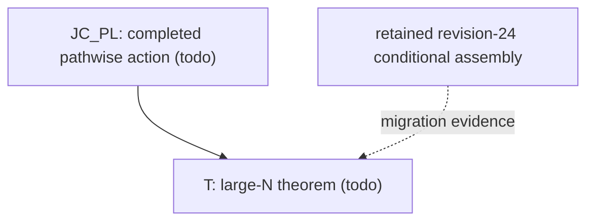

# Large-N polygonal Polya-Szego proof workspace

> **Status:** math-proof Stage 3 / unconditional theorem in progress. The
> repository does **not** claim that the main theorem or `JC_PL` is proved.

The maintained workspace is:

`math-proof-output/large-n-polya-szego/`

Its canonical dependency cut is currently:



Only the two Crux-Gate rows `T` and `JC_PL` are current blueprint nodes. The
19-module conditional assembly is retained intact as source evidence, but it
is not silently promoted to a current math-proof audit state.

## Canonical files

- `math-proof-output/large-n-polya-szego/proof-blueprint.md`: frozen theorem,
  route screen, current DAG, status, audit, and certificate plan.
- `math-proof-output/large-n-polya-szego/definitions-and-notation.md`: shared
  objects, conventions, symbols, and problem-specific failure checklist.
- `math-proof-output/large-n-polya-szego/literature-review.md`: citation cache
  and source-verification state.
- `math-proof-output/large-n-polya-szego/parts/`: canonical Markdown proof
  parts admitted by the current Crux Gate.
- `math-proof-output/large-n-polya-szego/scratch/route-history.md`: compact
  history of disproved, retracted, and inactive routes.

## Retained conditional assembly

- `math-proof-output/large-n-polya-szego/source/conditional-assembly/`: the
  modular TeX source, PDF, recorder file, and 19 topologically ordered modules.
- `math-proof-output/large-n-polya-szego/source/revision-24-proof-dag.json`:
  legacy conceptual/assembly manifest used to check the retained source.
- `math-proof-output/large-n-polya-szego/audits/conditional-frontier-audit.md`:
  audit of conditional-frontier consistency only.

## Validate

From the repository root:

```powershell
$skillRoot = 'C:\Users\cheng\.codex\skills\math-proof'
$workspace = 'math-proof-output\large-n-polya-szego'
python "$skillRoot\scripts\workspace_doctor.py" check $workspace
python "$skillRoot\scripts\check_blueprint.py" --stage auto `
  "$workspace\proof-blueprint.md"
python scripts\check_conditional_assembly.py
```

The checks validate structure and evidence consistency, not mathematical
truth. See `MAINTENANCE.md` before changing a statement, route, edge, or status.
