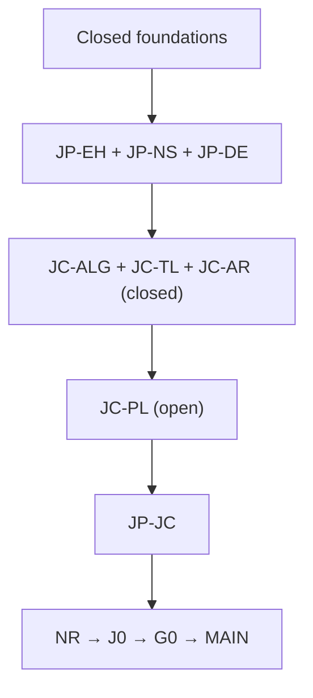

# Large-\(N\) Pólya--Szegő proof DAG

> **Status:** conditional proof / active frontier. This repository does **not**
> claim an unconditional proof of the convex large-\(N\) polygonal
> Pólya--Szegő theorem.

This is the cleaned, modular revision-24 proof package. Historical stage
snapshots, duplicate builds, numerical scratch files, and superseded proof
drafts have been omitted.

## Current theorem

The assembled theorem is conditional on the pathwise LCA payment `JC-PL`:

> Assume `JC-PL`. Then, for all sufficiently large \(N\), the regular
> \(N\)-gon uniquely minimizes the first Dirichlet eigenvalue among convex
> \(N\)-gons of fixed area, up to congruence.

The exact dependency frontier is:



`JC-PL` contains two still-unproved subcontracts:

- `JC-SP`: uniform continuity of the completed-action Hessian in the natural
  energy on the super-near chart;
- `JC-CL`: coarse/far localization, including the regular monotone-transport
  coercivity problem and the nonregular original-path row.

## Files

- [`proof/conditional-proof.tex`](proof/conditional-proof.tex): modular LaTeX
  entry point for the complete conditional assembly.
- [`proof/parts/`](proof/parts): the 19 proof modules in DAG/topological order.
- [`proof/conditional-proof.pdf`](proof/conditional-proof.pdf): compiled proof.
- [`proof/conditional-proof.fls`](proof/conditional-proof.fls): LaTeX recorder.
- [`docs/proof-audit.md`](docs/proof-audit.md): concise status, citation, compilation,
  and integrity audit.
- [`dag/proof-dag.json`](dag/proof-dag.json): machine-readable conceptual DAG.
- [`docs/wrong-routes.md`](docs/wrong-routes.md): concise record of retracted, disproved,
  or inactive routes.
- [`MAINTENANCE.md`](MAINTENANCE.md): ownership rules and the update checklist.
- [`scripts/check_repo.py`](scripts/check_repo.py): structural DAG/source check.

## Build

From the repository root:

```powershell
cd proof
latexmk -pdf -no-shell-escape -recorder -file-line-error `
  -interaction=nonstopmode -halt-on-error conditional-proof.tex
```

Then verify the source layout and DAG:

```powershell
python scripts/check_repo.py
```

See [`proof/README.md`](proof/README.md) for the module index.
